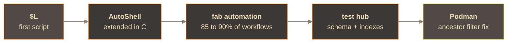

<p>
  <a href="https://zaidmarwat.com"></a>
  <a href="mailto:zaidratify123@gmail.com"></a>
  <a href="https://patents.google.com/patent/US20240085134A1/en"></a>
  
</p>

<p>
  
  
  
  
  
  
  
  
  
  
</p>

---

### The through-line

The first program I wrote saved the last command's output into a variable called
[`$L`](https://github.com/ZaidMarwat/L), so I could hand it to the next one. It was not
elegant. The habit stuck. When a system makes me do something tedious twice, I build the
thing that does it for me.



The scale changes. The instinct does not. Make the layer underneath more trustworthy, so the
people standing on it can move faster.

---

### Selected work

<details open>
<summary><b>🔧 Podman #27778.</b> A fix so the <code>ancestor</code> filter resolves image names to IDs <em>(open)</em></summary>

<br/>

Image names are **mutable**. A tag can point at a different image tomorrow. Image IDs are
not. The `--filter ancestor=` path was comparing against the name, so a container could be
matched to the wrong ancestor once a tag moved.

```go
// pkg/domain/filters/containers.go   +43 −35
// resolve the supplied name to an immutable ID before comparing
```

Closes [#27743](https://github.com/podman-container-tools/podman/issues/27743) ·
[read the PR →](https://github.com/podman-container-tools/podman/pull/27778)

</details>

<details>
<summary><b>📜 U.S. Patent US20240085134A1.</b> Thermal imaging built to help avoid friendly fire</summary>

<br/>

Real-time detection of human silhouettes in live infrared feeds. The hard part was never
detection. It was detection *fast enough to matter*. In a safety system, a correct answer
that arrives late is worse than useless. So most of the work was profiling the pipeline end
to end and sharpening the hot path.

`Python` · `OpenCV` · `Embedded Linux` ·
[read the patent →](https://patents.google.com/patent/US20240085134A1/en)

</details>

<details>
<summary><b>🧠 Brain-Computer Interface Wheelchair.</b> Published research, shown on CBS</summary>

<br/>

A close friend's grandfather was losing the ability to walk. So a few of us built a BCI
wheelchair prototype in his honour. It runs a real-time EEG pipeline in C++ and Python on a
Raspberry Pi, turning noisy sensor data into movement, with ML classification tuned for the
noise of the real world.

Presented at the Advancing Healthcare Innovation Summit, featured on CBS, and published in
the *Journal of Innovation in Digital Health, Diagnostics, and Biomarkers*.

It is the one I am proudest of, because it started with somebody specific rather than a spec.

</details>

<details>
<summary><b>⌨️ tsk.</b> A task manager that lives in your terminal</summary>

<br/>

SQLite-backed, zero dependencies, 59 tests. Built because the alternative was another
Electron app.

```
$ tsk list
  5 [ ]! Email recruiter          4d ago    +jobhunt
  1 [ ]! Fix ancestor filter      tomorrow  +podman  @go @oss
  2 [ ]  Push profile README      today     +jobhunt
```

`--json` on every command, so it pipes into `jq`. Exit codes are part of the contract.
One index, shaped for the only query that runs constantly.

[browse the code →](https://github.com/ZaidMarwat/tsk)

</details>

---

### Where I've worked

| | | |
|---|---|---|
| **Visa** | Software Engineer Intern | May to Aug 2026 |
| **Texas Instruments** | Software Engineer Intern | May to Aug 2025 |

<details>
<summary>what I actually did</summary>

<br/>

**Visa.** I worked on backend services and test infrastructure over high-volume transaction
data in live payment systems. I built the internal test hub and owned the schema and
indexing decisions behind it. Dashboards, logging pipelines, A/B tests, and on-call.

**Texas Instruments.** I automated 85 to 90% of fab simulation workflows across distributed
Linux compute, and extended the internal shell scripting language, written in C, that drives
them. Error handling and job recovery saved over 150 machine hours a quarter. I carried
on-call for job failures and wrote the runbooks other engineers worked from.

</details>

---

### Away from a terminal

I taught myself piano from those YouTube videos with the falling notes, practising at night
in an empty dorm room. Mostly anime soundtracks. *Hikaru Nara* took the longest to learn and
is still my favourite. I am an officer of my university's fragrance club, which sounds like
a joke until you notice that a scent is a system too. It is layered, it follows rules, and
it is shaped quietly by everyone around the person who chose it. Right now I am deep in
Sanderson's *Stormlight Archive*.

<sub>nvim, unreasonably. 📫 <a href="mailto:zaidratify123@gmail.com">zaidratify123@gmail.com</a></sub>
